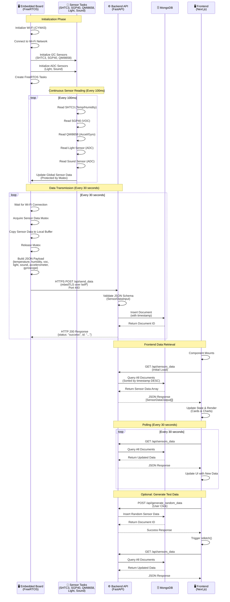
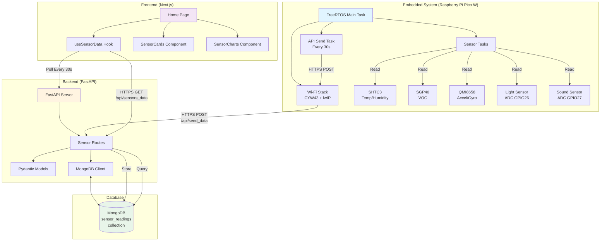
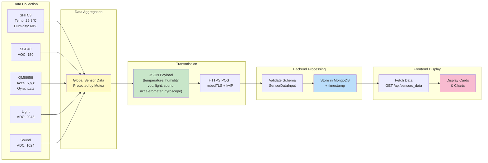
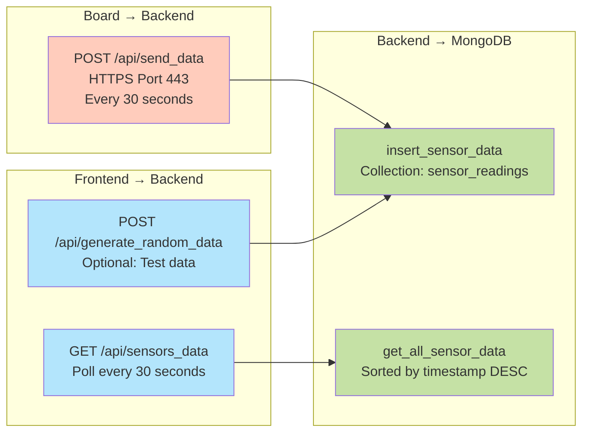

# Communication Flow Diagram

```mermaid
sequenceDiagram
    participant Board as 🖥️ Embedded Board<br/>(FreeRTOS)
    participant Sensors as 📡 Sensor Tasks<br/>(SHTC3, SGP40, QMI8658,<br/>Light, Sound)
    participant Backend as ⚙️ Backend API<br/>(FastAPI)
    participant MongoDB as 🗄️ MongoDB
    participant Frontend as 🖥️ Frontend<br/>(Next.js)

    Note over Board,Sensors: Initialization Phase
    Board->>Board: Initialize Wi-Fi (CYW43)
    Board->>Board: Connect to Wi-Fi Network
    Board->>Sensors: Initialize I2C Sensors<br/>(SHTC3, SGP40, QMI8658)
    Board->>Sensors: Initialize ADC Sensors<br/>(Light, Sound)
    Board->>Board: Create FreeRTOS Tasks

    Note over Sensors: Continuous Sensor Reading (Every 100ms)
    loop Every 100ms
        Sensors->>Sensors: Read SHTC3 (Temp/Humidity)
        Sensors->>Sensors: Read SGP40 (VOC)
        Sensors->>Sensors: Read QMI8658 (Accel/Gyro)
        Sensors->>Sensors: Read Light Sensor (ADC)
        Sensors->>Sensors: Read Sound Sensor (ADC)
        Sensors->>Board: Update Global Sensor Data<br/>(Protected by Mutex)
    end

    Note over Board,Backend: Data Transmission (Every 30 seconds)
    loop Every 30 seconds
        Board->>Board: Wait for Wi-Fi Connection
        Board->>Board: Acquire Sensor Data Mutex
        Board->>Board: Copy Sensor Data to Local Buffer
        Board->>Board: Release Mutex
        Board->>Board: Build JSON Payload<br/>{temperature, humidity, voc,<br/>light, sound, accelerometer,<br/>gyroscope}
        Board->>Backend: HTTPS POST /api/send_data<br/>(mbedTLS over lwIP)<br/>Port 443
        Backend->>Backend: Validate JSON Schema<br/>(SensorDataInput)
        Backend->>MongoDB: Insert Document<br/>(with timestamp)
        MongoDB-->>Backend: Return Document ID
        Backend-->>Board: HTTP 200 Response<br/>{status: "success", id: "..."}
    end

    Note over Frontend,Backend: Frontend Data Retrieval
    Frontend->>Frontend: Component Mounts
    Frontend->>Backend: GET /api/sensors_data<br/>(Initial Load)
    Backend->>MongoDB: Query All Documents<br/>(Sorted by timestamp DESC)
    MongoDB-->>Backend: Return Sensor Data Array
    Backend-->>Frontend: JSON Response<br/>[SensorDataOutput[]]
    Frontend->>Frontend: Update State & Render<br/>(Cards & Charts)

    Note over Frontend,Backend: Polling (Every 30 seconds)
    loop Every 30 seconds
        Frontend->>Backend: GET /api/sensors_data
        Backend->>MongoDB: Query All Documents
        MongoDB-->>Backend: Return Updated Data
        Backend-->>Frontend: JSON Response
        Frontend->>Frontend: Update UI with New Data
    end

    Note over Frontend,Backend: Optional: Generate Test Data
    Frontend->>Backend: POST /api/generate_random_data<br/>(User Click)
    Backend->>MongoDB: Insert Random Sensor Data
    MongoDB-->>Backend: Return Document ID
    Backend-->>Frontend: Success Response
    Frontend->>Frontend: Trigger refetch()
    Frontend->>Backend: GET /api/sensors_data
    Backend->>MongoDB: Query All Documents
    MongoDB-->>Backend: Return Updated Data
    Backend-->>Frontend: JSON Response
```

## Architecture Overview

```mermaid
graph TB
    subgraph "Embedded System (Raspberry Pi Pico W)"
        Board[FreeRTOS Main Task]
        WiFi[Wi-Fi Stack<br/>CYW43 + lwIP]
        Sensors[Sensor Tasks]
        APITask[API Send Task<br/>Every 30s]
        
        Board --> WiFi
        Board --> Sensors
        Board --> APITask
        Sensors --> |Read| SHTC3[SHTC3<br/>Temp/Humidity]
        Sensors --> |Read| SGP40[SGP40<br/>VOC]
        Sensors --> |Read| QMI8658[QMI8658<br/>Accel/Gyro]
        Sensors --> |Read| Light[Light Sensor<br/>ADC GPIO26]
        Sensors --> |Read| Sound[Sound Sensor<br/>ADC GPIO27]
        APITask --> |HTTPS POST| WiFi
    end

    subgraph "Backend (FastAPI)"
        API[FastAPI Server]
        Routes[Sensor Routes]
        Models[Pydantic Models]
        DB[MongoDB Client]
        
        API --> Routes
        Routes --> Models
        Routes --> DB
    end

    subgraph "Database"
        MongoDB[(MongoDB<br/>sensor_readings<br/>collection)]
    end

    subgraph "Frontend (Next.js)"
        Page[Home Page]
        Hook[useSensorData Hook]
        Cards[SensorCards Component]
        Charts[SensorCharts Component]
        
        Page --> Hook
        Page --> Cards
        Page --> Charts
        Hook --> |Poll Every 30s| API
    end

    WiFi --> |HTTPS POST<br/>/api/send_data| Routes
    Hook --> |HTTPS GET<br/>/api/sensors_data| Routes
    DB <--> MongoDB
    Routes --> |Store| MongoDB
    Routes --> |Query| MongoDB

    style Board fill:#e1f5ff
    style API fill:#fff4e1
    style MongoDB fill:#e8f5e9
    style Page fill:#f3e5f5
```

## Data Flow Diagram

```mermaid
flowchart LR
    subgraph "Data Collection"
        S1[SHTC3<br/>Temp: 25.3°C<br/>Humidity: 60%]
        S2[SGP40<br/>VOC: 150]
        S3[QMI8658<br/>Accel: x,y,z<br/>Gyro: x,y,z]
        S4[Light<br/>ADC: 2048]
        S5[Sound<br/>ADC: 1024]
    end

    subgraph "Data Aggregation"
        GlobalData[Global Sensor Data<br/>Protected by Mutex]
    end

    subgraph "Transmission"
        JSON["JSON Payload<br/>{temperature, humidity,<br/>voc, light, sound,<br/>accelerometer, gyroscope}"]
        HTTPS[HTTPS POST<br/>mbedTLS + lwIP]
    end

    subgraph "Backend Processing"
        Validate[Validate Schema<br/>SensorDataInput]
        Store[Store in MongoDB<br/>+ timestamp]
    end

    subgraph "Frontend Display"
        Fetch[Fetch Data<br/>GET /api/sensors_data]
        Display[Display Cards<br/>& Charts]
    end

    S1 --> GlobalData
    S2 --> GlobalData
    S3 --> GlobalData
    S4 --> GlobalData
    S5 --> GlobalData
    GlobalData --> JSON
    JSON --> HTTPS
    HTTPS --> Validate
    Validate --> Store
    Store --> Fetch
    Fetch --> Display

    style GlobalData fill:#fff9c4
    style JSON fill:#c8e6c9
    style Store fill:#bbdefb
    style Display fill:#f8bbd0
```

## Endpoint Summary

```mermaid
graph LR
    subgraph "Board → Backend"
        E1[POST /api/send_data<br/>HTTPS Port 443<br/>Every 30 seconds]
    end

    subgraph "Backend → MongoDB"
        E2[insert_sensor_data<br/>Collection: sensor_readings]
        E3[get_all_sensor_data<br/>Sorted by timestamp DESC]
    end

    subgraph "Frontend → Backend"
        E4[GET /api/sensors_data<br/>Poll every 30 seconds]
        E5[POST /api/generate_random_data<br/>Optional: Test data]
    end

    E1 --> E2
    E4 --> E3
    E5 --> E2

    style E1 fill:#ffccbc
    style E2 fill:#c5e1a5
    style E3 fill:#c5e1a5
    style E4 fill:#b3e5fc
    style E5 fill:#b3e5fc
```
